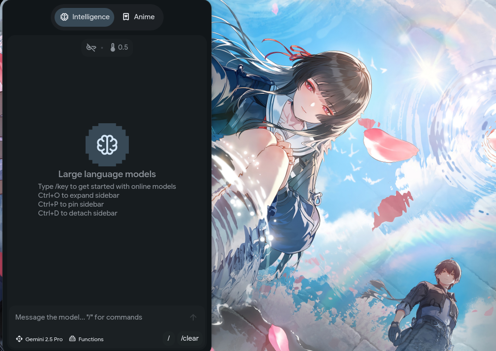
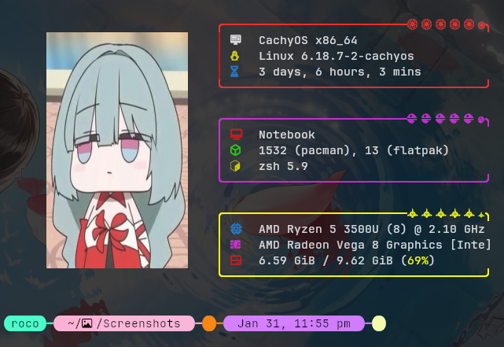

# 🌙 Hyper Dots — Hyprland Configuration

### 🖥️ Desktop Showcase


### 💻 Terminal & System


Personal **Hyprland** configuration based on the **end-4** dots ecosystem, heavily refactored for modern Hyprland versions, performance on integrated graphics, and a clean, efficient daily workflow.

---

## 🔧 2026 Optimization Notes

This setup is a **hardened and optimized evolution** of the end-4 dots, specifically refactored for **Hyprland v0.45+** and **AMD Ryzen Vega 8** hardware.

- **Modern Syntax Refactoring**  
  Migrated all legacy `windowrulev2` directives to the new **Block Syntax** (`windowrule { ... }`), ensuring compatibility with current Hyprland releases and eliminating common *“missing value”* syntax errors.

- **Hardware-Specific Tuning**  
  Disabled unnecessary blur and shadows globally to maximize performance on integrated GPUs, while preserving visual quality through selective **Layer Rules**.

- **Gaming Performance (Tearing & Input Lag)**  
  Implemented immediate window rules (`immediate = on`) and opacity overrides for **Steam** and **Minecraft**, significantly reducing tearing and input latency.

- **Intelligent Scaling**  
  Refactored floating window dimensions using monitor-relative variables (e.g. `monitor_w * 0.45`), ensuring consistent UI behavior across different resolutions.

- **Plugin Workflow Stability**  
  Integrated a reliable `hyprpm` update workflow with required build dependencies (`cmake`, `meson`, `cpio`) to maintain **Hyprbars** and other AGS-related plugins.

- **Workflow Automation & Maintainability**  
  Reorganized `rules.conf` to centralize logic, simplifying management of custom workspace behaviors and application-specific floating rules (e.g. OnlyOffice, system dialogs).

---

## ⌨️ Keybindings — Essential Workflow

This workflow is optimized for **speed, minimalism, and muscle memory**.  
Below are the most important shortcuts.

### 🚀 System & Applications
- **Super + T** → Launch Terminal (Foot / Kitty)
- **Super + E** → Open File Manager (Dolphin)
- **Super + Q** → Close active window
- **Super + R** → Application launcher
- **Super + Shift + C** → Reload Hyprland configuration

### 🪟 Window Management
- **Super + Arrow Keys** → Change window focus
- **Super + Left Mouse** → Move floating window
- **Super + Right Mouse** → Resize floating window
- **Super + F** → Toggle fullscreen
- **Super + V** → Toggle tiling / floating mode

### 󱂬 Workspaces
- **Super + [1–9]** → Switch workspace
- **Super + Shift + [1–9]** → Move window to workspace
- **Super + S** → Toggle **Special Workspace**  
  *(used for Spotify, Discord, or quick tasks)*

### 🛠️ Media & UI
- **Multimedia Keys** → Volume & brightness control (AGS / Waybar)
- **Super + N** → Open notification center
- **Super + K** → Open keybinding cheatsheet

---

## ✨ Key Features
- **Window Manager:** Hyprland (Wayland)
- **Status Bar:** Highly customized Waybar
- **Lock Screen:** Hyprlock with custom background
- **Idle Daemon:** Hypridle integration
- **Terminal:** Optimized with custom styling
- **Workflow:** Minimal, keyboard-driven, performance-oriented

---

## 📦 Requirements
- Hyprland (v0.45+)
- waybar
- hyprlock
- hypridle
- ags
- wl-clipboard
- grim / slurp

---

## 🛠️ Installation (Optional)

⚠️ These are **personal dotfiles**.  
Make sure to **backup your existing configuration** before applying.

```bash
git clone https://github.com/ROC003/hyper-dots.git ~/hyper-dots
cp -r ~/hyper-dots/* ~/.config/hypr/
---
Developed with ❤️ by [ROC003](https://github.com/ROC003)
EOF
